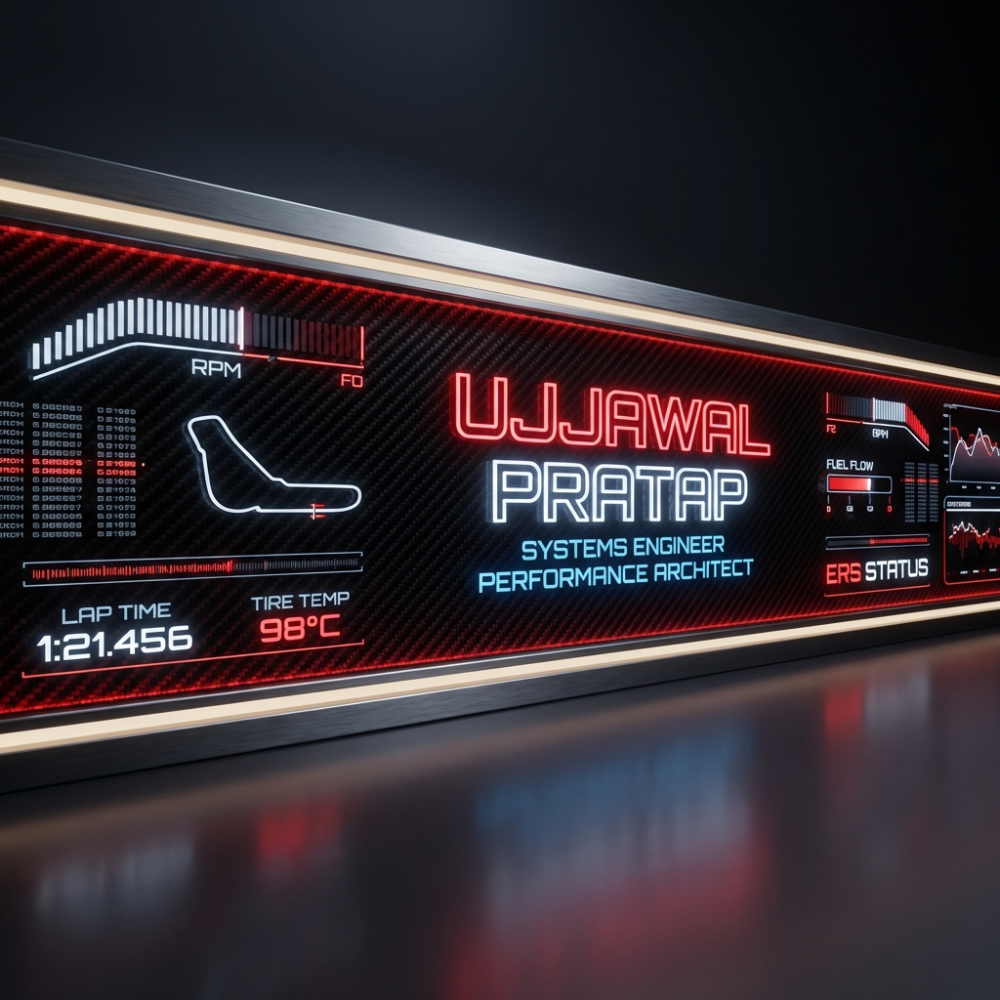

  
  
   
  
  

   
  
  
  
  

 

  
  

 

---

### 🏎️ DRIVER TELEMETRY

  <table width="100%" style="border: 0; background-color: #0d1117;">
    <tr>
      <td width="50%" valign="top">
        <h3>📂 PILOT DATA</h3>
         
        <b>&nbsp; ROLE</b> &nbsp; :: &nbsp; <code>SYSTEMS ENGINEER</code>  
        <b>&nbsp; TEAM</b> &nbsp; :: &nbsp; <code>UNIVERSITY OF ALBERTA</code>  
        <b>&nbsp; CORE</b> &nbsp; :: &nbsp; <code>LOW-LATENCY ARCHITECTURE</code>  
        <b>&nbsp; FUEL</b> &nbsp; :: &nbsp; <code>COFFEE && ALGORITHMS</code>
      </td>
      <td width="50%" valign="top">
        <h3>📡 LIVE STATUS</h3>
         
        <b>&nbsp; CURRENT LAP</b> &nbsp; :: &nbsp; <code>ARCHITECTING MIDDLEWARE</code>  
        <b>&nbsp; TRAINING</b> &nbsp; :: &nbsp; <code>3D PIPELINES / GAME ALGO</code>  
        <b>&nbsp; READING</b> &nbsp; :: &nbsp; <code>RL: SUTTON & BARTO</code>  
        <b>&nbsp; TRACK</b> &nbsp; :: &nbsp; 🟢 <code>GREEN (OPEN TO WORK)</code>
      </td>
    </tr>
  </table>

 

### 🛠️ THE PIT LANE (PROJECTS)

| **CHASSIS (CLASS)** | **SPECIFICATIONS** | **ENGINE (TECH)** |
| :--- | :--- | :--- |
| **GRAPHICS** | **[C-Ray Engine](https://github.com/ujjawalsuii/c-ray-engine)**   `PHYSICS_BASED_RAY_TRACER`   *Built from scratch. High performance.* |   |
| **INTELLIGENCE** | **[Leo the Lion](https://github.com/Gfewq/Team)**   `AI_HEALTH_COMPANION`   *Pediatric health monitoring system.* |   |
| **COMPILER** | **[RISC-V Translator](https://github.com/ujjawalsuii/rv-to-wasm)**   `ASM_TO_WASM_STATIC`   *Binary translation layer.* |   |
| **MOBILE** | **[Event Lottery](https://github.com/CMPUT301F25aurora/aurora-borealis)**   `HIGH_CONCURRENCY_SYS`   *Android event management.* |   |

 

### 📟 ENGINE CONFIGURATION (SKILLS)

| **SYSTEM** | **MODULES** |
| :--- | :--- |
| **KERNEL / LOW** |    |
| **AERO / WEB** |    |
| **STRATEGY / AI** |    |
| **TOOLS / OPS** |    |

 

  

