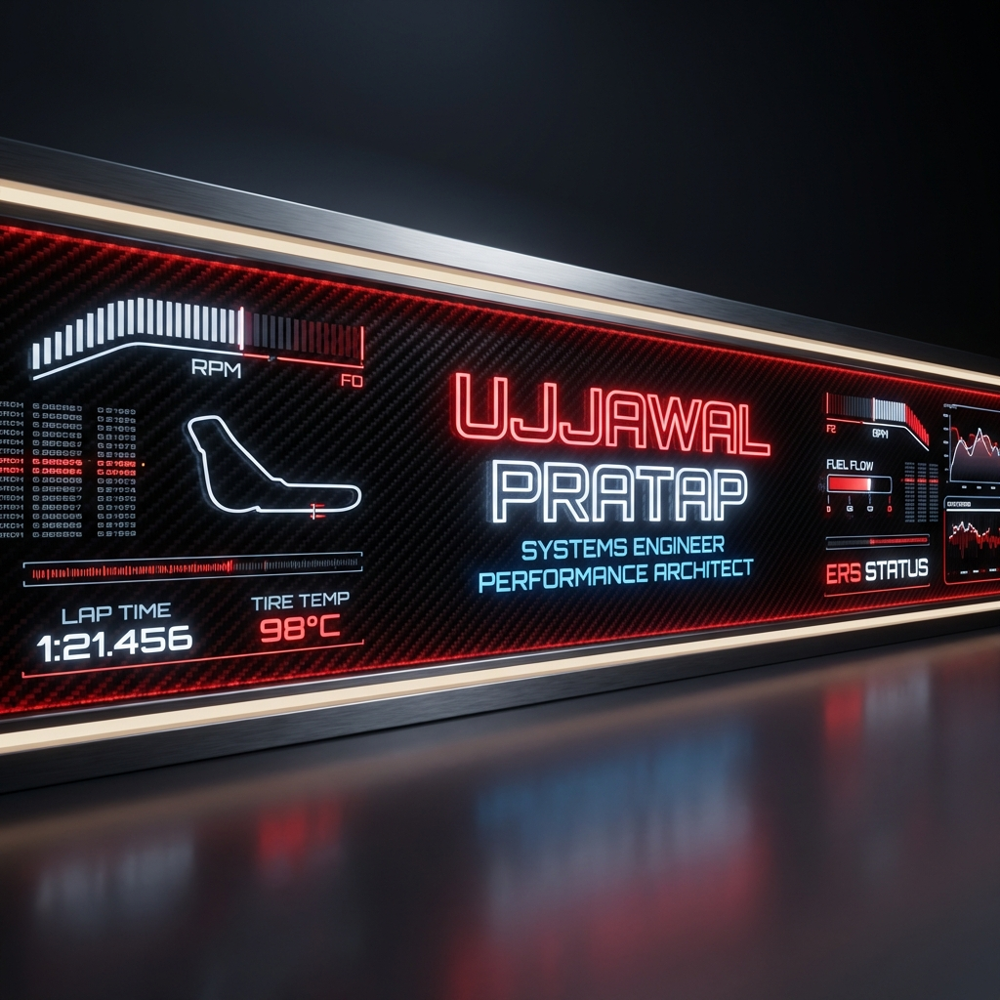

  
  
   
  
  

   
  
  
  
  

 

  
  

 

---

### 🏎️ DRIVER TELEMETRY

  <table border="0" width="100%" style="background-color: #0d1117; border-collapse: collapse;">
    <tr>
      <td width="50%" valign="top" style="padding: 20px;">
        <h3 align="center">📂 PILOT DATA</h3>
        <table border="0" width="100%">
            <tr>
                <td width="30%"><b>ROLE</b></td>
                <td><code>FULL-STACK // AI</code></td>
            </tr>
            <tr>
                <td><b>TEAM</b></td>
                <td><code>U OF ALBERTA (CS)</code></td>
            </tr>
            <tr>
                <td><b>CORE</b></td>
                <td><code>LOW-LATENCY SYS</code></td>
            </tr>
            <tr>
                <td><b>FUEL</b></td>
                <td><code>COFFEE && ALGORITHMS</code></td>
            </tr>
        </table>
      </td>
      <td width="50%" valign="top" style="padding: 20px;">
        <h3 align="center">📡 LIVE STATUS</h3>
        <table border="0" width="100%">
            <tr>
                <td width="30%"><b>LAP</b></td>
                <td><code>ARCHITECTING_MW</code></td>
            </tr>
            <tr>
                <td><b>FOCUS</b></td>
                <td><code>AI_AGENTS // 3D_PIPELINES</code></td>
            </tr>
            <tr>
                <td><b>READ</b></td>
                <td><code>RL_INTRO (SUTTON)</code></td>
            </tr>
            <tr>
                <td><b>TRACK</b></td>
                <td>🟢 <code>OPEN_TO_WORK</code></td>
            </tr>
        </table>
      </td>
    </tr>
  </table>

 

### 🛠️ THE PIT LANE (PROJECTS)

| **CHASSIS (CLASS)** | **SPECIFICATIONS** | **ENGINE (TECH)** |
| :--- | :--- | :--- |
| **INTELLIGENCE** | **[Leo the Lion](https://github.com/Gfewq/Team)**   `RAG_HEALTH_AGENT`   *Grounded LLM responses over medical protocols. TELUS Hackathon Top 5.* |    |
| **NEURAL** | **[WebAble](https://github.com/ujjawalsuii/popowich-WebAble)**   `ON_DEVICE_INFERENCE`   *Hand-written MLP in vanilla JS. Live ASL recognition at 60 FPS.* |   |
| **GRAPHICS** | **[C-Ray Engine](https://github.com/ujjawalsuii/c-ray-engine)**   `PHYSICS_BASED_RAY_TRACER`   *Built from scratch. High performance.* |   |
| **COMPILER** | **[RISC-V Translator](https://github.com/ujjawalsuii/rv-to-wasm)**   `ASM_TO_WASM_STATIC`   *Binary translation layer.* |   |
| **MOBILE** | **[Event Lottery](https://github.com/CMPUT301F25aurora/aurora-borealis)**   `HIGH_CONCURRENCY_SYS`   *Android event management.* |   |

 

### 📟 ENGINE CONFIGURATION (SKILLS)

| **SYSTEM** | **MODULES** |
| :--- | :--- |
| **AERO / WEB** |      |
| **STRATEGY / AI** |     |
| **KERNEL / LOW** |    |
| **TOOLS / OPS** |     |

 

  

